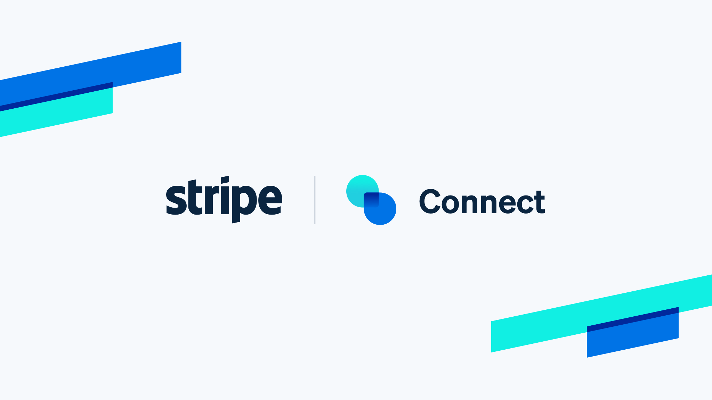

<p align="center">
  
</p>

<h1 align="center">SafePay: A Smart Escrow Layer for Digital Payments
</h1>

<p align="center">
  <strong>Secure. Transparent. Trustworthy.</strong><br/>
  A modern escrow payment infrastructure that holds funds safely and releases them only when both parties are satisfied.
</p>

<p align="center">
  <a href="#">🚀 View Demo </a> •
  <a href="https://github.com/Santhosh-0031/escrow-payment-system/issues">🐛 Report Bug</a> •
  <a href="https://github.com/Santhosh-0031/escrow-payment-system/issues">✨ Request Feature</a>
</p>

<p align="center">
  
  
  
  
</p>

---

## 📌 Overview

**SafePay** is a production-ready escrow payment platform designed to eliminate transactional risk between buyers and sellers. Payments are securely held in escrow for a configurable period (default: 48 hours) and automatically released to the seller only after the hold window expires — ensuring complete peace of mind for both parties.

Whether you're building a marketplace, a freelance platform, or a rental service, SafePay provides the financial trust layer your users deserve.

---

## ✨ Core Features

| Feature | Description |
|---|---|
| 🔒 **Smart Escrow Holds** | Automatically hold buyer payments for a configurable duration before releasing funds to sellers |
| 💳 **Stripe Integration** | Seamless, production-grade payment processing powered by the Stripe API |
| 🔑 **Secure Authentication** | JWT-based login and signup system with role-based access for buyers, sellers, and admins |
| 💰 **Automated Seller Payouts** | Funds are disbursed to seller accounts automatically once the hold period concludes |
| 📊 **Role-Based Dashboards** | Dedicated, intuitive dashboards for buyers, sellers, and administrators |
| 🛡️ **Admin Control Panel** | Full visibility into all transactions with audit, management, and override capabilities |

---

## 🌍 Real-World Use Cases

### 🛍️ E-Commerce Marketplaces
Hold buyer payments until delivery is confirmed, drastically reducing fraud and disputes on marketplace platforms.

### 👨‍💻 Freelance & Gig Platforms
Guarantee fair outcomes for both clients and freelancers — funds are only released after work milestones are verified and approved.

### 🏠 Rental & Leasing Services
Securely hold rental deposits and service payments, releasing them only after the item is returned or the service is completed satisfactorily.

### 🎟️ Event Ticketing & Bookings
Protect buyers by holding event payments in escrow until the event concludes, with automatic refund logic for cancellations.

---

## 🖥️ Tech Stack

| Layer | Technology |
|---|---|
| **Frontend** | React, Tailwind CSS |
| **Backend** | Node.js, Express.js |
| **Database** | MongoDB |
| **Payments** | Stripe API |
| **Authentication** | JSON Web Tokens (JWT) |

---

## 🚀 Getting Started

### Prerequisites

Ensure the following are installed and configured before proceeding:

- [Node.js](https://nodejs.org/) (v18+) and npm
- A running [MongoDB](https://www.mongodb.com/) instance (local or Atlas)
- A [Stripe](https://stripe.com/) account with API keys

---

### 🛠️ Installation

#### 1. Clone the Repository

```bash
git clone https://github.com/Santhosh-0031/escrow-payment-system.git
cd escrow-payment-system
```

#### 2. Install Dependencies

**Backend:**
```bash
cd backend
npm install
```

**Frontend:**
```bash
cd frontend
npm install
```

---

### ⚙️ Environment Variables

Create a `.env` file in the `server/` directory and populate it with the following:

```env
# Server
PORT=5000

# Database
MONGO_URI=your_mongodb_connection_string

# Authentication
JWT_SECRET=your_jwt_secret_key

# Stripe
STRIPE_SECRET_KEY=your_stripe_secret_key
STRIPE_WEBHOOK_SECRET=your_stripe_webhook_secret
```

> ⚠️ **Never commit your `.env` file to version control.** Add it to `.gitignore`.

---

### ▶️ Running the Application

**Start the frontend server:**
```bash
cd frontend
npm run dev
```

**Start the backend client:**
```bash
cd backend
npm start
```

The application will be available at `http://localhost:3000` by default.

---

## 📸 Screenshots

<p align="center">
  
</p>

<p align="center">
  
</p>

---
## 🎥 Demo Video

<p align="center">
  <a href="https://github.com/Santhosh-0031/escrow-payment-system/blob/main/assets/stripeConnectDemo.mp4">
    
  </a>
</p>

---

## 🔮 Future Enhancements

The roadmap for SafePay includes the following planned capabilities:

- 🤖 **AI-Powered Fraud Detection** — Real-time transaction anomaly detection using machine learning models
- ⛓️ **Blockchain Audit Trail** — Immutable, on-chain transaction records for maximum transparency
- 🌐 **Multi-Currency Support** — Cross-border payments with automatic currency conversion
- 📱 **Mobile Application** — Native iOS and Android apps for on-the-go transaction management
- 🔔 **Smart Notifications** — Real-time email and push notifications for payment lifecycle events
- 🧩 **API-First Architecture** — Public REST API with developer documentation for third-party integrations

---

## 📄 License

This project is licensed under the **MIT License**. See the [LICENSE](./LICENSE) file for full details.

---

<p align="center">
  Built with ❤️ by <a href="https://github.com/Santhosh-0031">Santhosh</a> · 
  <a href="https://github.com/Santhosh-0031/escrow-payment-system">GitHub Repository</a>
</p>
